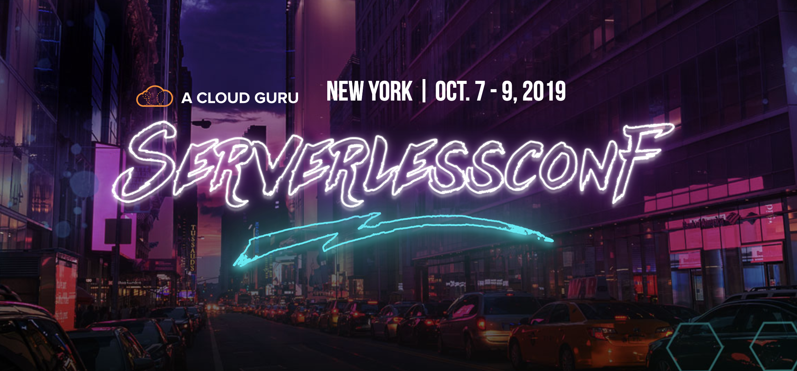

## Serverless Conf - Real-time as a first class citizen

This repo holds the code for my demos at my talk from Serverless Conf

### Google Docs in Markdown

Live demo: [writewithme.dev](https://www.writewithme.dev/)

Schema:

```graphql
type Post @model {
  id: ID!
  clientId: ID!
  markdown: String!
  title: String!
  createdAt: String
}

type Subscription {
  onUpdatePostWithId(id: ID!): Post
    @aws_subscribe(mutations: ["updatePost"])
}
```

Repo: [Write with me](https://github.com/dabit3/write-with-me)

### Real-time Beatbox

Live demo: [hypebeats.dev](https://www.hypebeats.dev/)

Schema:

```graphql
type DrumMachine @model {
  id: ID!
  clientId: ID!
  beats: String!
  name: String!
}

type Subscription {
  onUpdateByID(id: ID!): DrumMachine
    @aws_subscribe(mutations: ["updateDrumMachine"])
}
```

Repo: [HypeBeats](https://github.com/dabit3/hype-beats)

### Real-time image tracking

Schema:

```graphql
type ImageData @model
  @auth(rules: [
    { allow: public },
    { allow: private }
    ])
{
  id: ID!
  imageKey: String
  rekognitionData: String
  imageTypes: [String]
}

type Query {
	process(imageKey: String!): ImageData @function(name: "rekognitionfunction-${env}")
}
```

Repo: [Real-time image tracking](https://github.com/dabit3/real-time-image-tracking)
